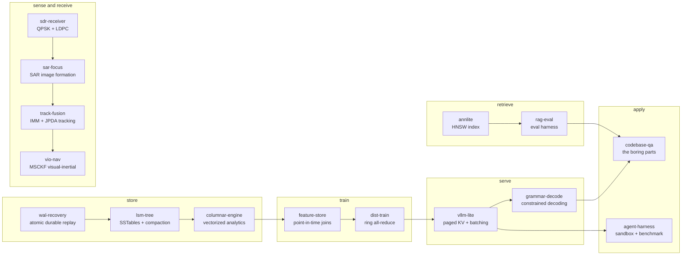

<picture>
  <source media="(prefers-color-scheme: dark)" srcset="banner-dark.svg">
  <source media="(prefers-color-scheme: light)" srcset="banner-light.svg">
  
</picture>

## Systems, not scripts

I'm a computer science undergrad at UGA. Most of what I build is the layer
*underneath* machine learning — the schedulers, indexes, collectives and
evaluation harnesses that decide whether a model is actually usable — written
from scratch and benchmarked against the thing it is supposed to beat.

Two rules I hold myself to across every repo here:

- **The deliverable is a measurement, not a demo.** Every project ships a
  benchmark you can run, against a real baseline, on data I didn't generate to
  flatter myself.
- **Report where it loses.** A speedup with no regime where it's slower is
  usually a broken benchmark. Each README has a section on the cases the
  approach handles badly, because that's the part that shows I understand it.

## What I've built

| project | what it is | the number that matters |
|---|---|---|
| **[columnar-engine](https://github.com/asp53826/columnar-engine)** | C++17 vector-at-a-time engine — null bitmaps, selection vectors, joins, aggregation, TPC-H Q1 and scalar differential oracles | **6,288 assertions**; Q1 processes 53.1M rows/s and batched filters reach **1.94×** scalar |
| **[lsm-tree](https://github.com/asp53826/lsm-tree)** | C++17 storage engine — WAL, memtables, SSTables, Bloom filters, version-aware range scans and crash-safe compaction | **4,064 assertions** plus 100 randomized hard crashes with **zero acknowledged writes lost** |
| **[wal-recovery](https://github.com/asp53826/wal-recovery)** | Transactional WAL — CRC32 records, atomic replay, damaged-tail repair, external crash oracle and validated group commit | Zero crash-campaign losses; 16-way group commit reaches **40.2k tx/s, 2.58×** single commit |
| **[vllm-lite](https://github.com/asp53826/vllm-lite)** | LLM inference server — paged KV cache, continuous batching, prefix caching, speculative decoding, OpenAI-compatible API | **94% KV utilization vs 21%** for static batching; 2.9x throughput at 5.5x better TTFT |
| **[annlite](https://github.com/asp53826/annlite)** | HNSW vector index in C++17 — hand-vectorized distance kernels, Python bindings, HTTP service | Parity with **FAISS** at 0.99 recall, **1.83x faster at 0.999** — the same Pareto frontier, not a beaten benchmark |
| **[dist-train](https://github.com/asp53826/dist-train)** | Distributed training — ring all-reduce built from `send`/`recv`, plus data, tensor and pipeline parallelism | Ring moves **58.7 MB/worker vs 234.9 MB** naive at 8 workers, and the gap widens exactly as the arithmetic predicts |
| **[rag-eval](https://github.com/asp53826/rag-eval)** | RAG pipeline plus a reproducible eval harness that gates retrieval quality in CI | BM25 on SciFact reproduces the published BEIR number — **0.6643 vs 0.665** — so the ablations measure ideas, not my bugs |
| **[feature-store](https://github.com/asp53826/feature-store)** | Point-in-time correct training data, streaming materialization, drift monitoring | Time-travel leakage inflates the offline score by **0.059 AUC**, measured by keeping the leaky join next to the correct one |
| **[grammar-decode](https://github.com/asp53826/grammar-decode)** | Constrained decoding — JSON Schema compiled to a character automaton, then a cached token mask over a 50k vocabulary | **100% schema conformance against a 0% baseline**; masking up to 1203x faster than replaying the vocabulary |
| **[agent-harness](https://github.com/asp53826/agent-harness)** | LLM agent runtime — a five-layer sandbox and a programmatically graded benchmark | 57 tests, **25 of them escape attempts**. The sandbox is tested by attacking it, and refuses to run where it can't enforce |
| **[codebase-qa](https://github.com/asp53826/codebase-qa)** | Codebase Q&A service built around the unglamorous parts: auth, rate limiting, durable job queue, cost tracking, tracing | scrypt-hashed keys, constant-time comparison, revocation as a timestamp — the prototype-to-service gap, written down |
| **[sdr-receiver](https://github.com/asp53826/sdr-receiver)** | QPSK software-defined-radio receiver — RRC pulse shaping, carrier/timing acquisition, soft decisions, regular LDPC decoding | Full impaired receiver tracks coherent theory; **0 observed errors in 21,600 bits at 4–8 dB** after the LDPC waterfall |
| **[track-fusion](https://github.com/asp53826/track-fusion)** | Multi-target tracking — IMM filter bank, JPDA data association, Wald-test track scoring, OSPA evaluation | IMM cuts localisation error **47%** through a manoeuvre and costs **45%** on a target that never turns — both ends measured |
| **[sar-focus](https://github.com/asp53826/sar-focus)** | SAR image formation — pulse compression, backprojection, phase gradient autofocus, impulse response analysis | Resolution within **0.5%** of `0.886·c/2B` and `0.886·λR/2L`; sidelobes converge to the **−13.26 dB** theoretical floor |
| **[vio-nav](https://github.com/asp53826/vio-nav)** | GPS-denied navigation — MSCKF visual-inertial odometry, IMU preintegration on SO(3), null-space feature marginalisation | **51.9x** lower drift than inertial dead reckoning at 40 s; **65x** when the IMU bias starts unknown |

## Portfolio telemetry

<picture>
  <source media="(prefers-color-scheme: dark)" srcset="assets/telemetry-dark.svg">
  <source media="(prefers-color-scheme: light)" srcset="assets/telemetry-light.svg">
  
</picture>

<sub>Regenerated daily by <a href=".github/workflows/profile.yml">a GitHub Action</a> that reads every repo and <a href="scripts/telemetry.py">counts the test functions in the source</a> — not typed in by hand, and not fetched from a third-party stats service that could rate-limit or vanish. It reports <b>test functions</b>; <code>pytest</code> collects 639 cases from them, because four of these repos parametrise.</sub>

## How the pieces fit

Not fifteen unrelated weekend projects. Eleven form one path through a production
ML stack and the storage substrate beneath it. The other four are sensing and estimation —
coherent imaging, target tracking, recovering bits from a corrupted waveform,
and navigating without GPS — which is the same habit of measuring against a
known answer, pointed somewhere harder to fool yourself about.



## Stack

```
systems      C++17 · Python · Java · WAL · LSM/SSTables · columnar execution · SIMD · POSIX
ml           PyTorch · torch.distributed · HNSW · BM25 · cross-encoder reranking
signal       QPSK · RRC filters · carrier/timing acquisition · LDPC · min-sum decoding
radar        SAR backprojection · PGA autofocus · Kalman/IMM filtering · JPDA · OSPA
estimation   IMU preintegration · SO(3)/Lie groups · MSCKF · ATE/RPE · triangulation
services     FastAPI · SQLite/Postgres · durable job queues · scrypt · tracing
industrial   Power BI · Node-RED · CtrlX Core · ERP automation
```

Day job: automation and analytics at **MP Equipment** — dashboards, ERP
automation, and AR/AI for industrial food processing.

## Elsewhere

`aaryansp26@gmail.com`

Every repo above is MIT licensed. Clone one and run the benchmark — that's what
it's there for.

<sub>Banner generated by <a href="banner.py">banner.py</a>: animated SVG, two themes, respects <code>prefers-reduced-motion</code>.</sub>
