<picture>
  <source media="(prefers-color-scheme: dark)" srcset="banner-dark.svg">
  <source media="(prefers-color-scheme: light)" srcset="banner-light.svg">
  
</picture>

<p align="center">
  <a href="https://asp53826.github.io/counterexample/"><strong>ENTER COUNTEREXAMPLE</strong></a>&nbsp;&nbsp;·&nbsp;&nbsp;
  <a href="https://asp53826.github.io/witness/"><strong>RUN WITNESS</strong></a>&nbsp;&nbsp;·&nbsp;&nbsp;
  <a href="https://asp53826.github.io/witness/publications/WITNESS-Technical-Monograph.pdf"><strong>READ MONOGRAPH</strong></a>&nbsp;&nbsp;·&nbsp;&nbsp;
  <a href="https://asp53826.github.io/proofgraph/"><strong>OPEN PROOFGRAPH</strong></a>&nbsp;&nbsp;·&nbsp;&nbsp;
  <a href="https://asp53826.github.io/recruiter/"><strong>OPEN ENGINEERING OS</strong></a>&nbsp;&nbsp;·&nbsp;&nbsp;
  <a href="https://asp53826.github.io/tours/">TAKE A PROOF TOUR</a>&nbsp;&nbsp;·&nbsp;&nbsp;
  <a href="https://asp53826.github.io/resume/Aaryan-Patel-Systems-Resume.pdf">RÉSUMÉ</a>&nbsp;&nbsp;·&nbsp;&nbsp;
  <a href="https://asp53826.github.io/data/evidence.json">EVIDENCE MANIFEST</a>
</p>

<picture>
  <source media="(prefers-color-scheme: dark)" srcset="assets/proof-bus-dark.svg">
  <source media="(prefers-color-scheme: light)" srcset="assets/proof-bus-light.svg">
  
</picture>

## Execute the evidence

<a href="https://asp53826.github.io/witness/">
<picture>
  <source media="(prefers-color-scheme: dark)" srcset="assets/witness-chamber-dark.svg">
  <source media="(prefers-color-scheme: light)" srcset="assets/witness-chamber-light.svg">
  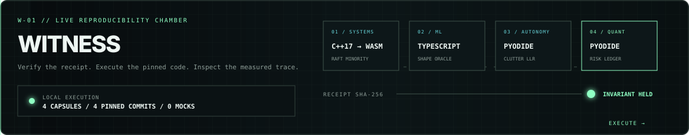
</picture>
</a>

**[WITNESS](https://asp53826.github.io/witness/)** verifies eight canonical
receipts, runs each pinned C++/WebAssembly, TypeScript, or Python implementation
inside the browser, compares the observed trace with its oracle, and emits a
local run receipt. The local receipt is explicitly unattested; release
provenance remains bound to COUNTEREXAMPLE.

**[Read the 23-page technical monograph](https://asp53826.github.io/witness/publications/WITNESS-Technical-Monograph.pdf)** ·
**[Inspect the GitHub edition](https://github.com/asp53826/witness/blob/main/docs/WITNESS-Technical-Monograph.md)** ·
**[Download the Word edition](https://github.com/asp53826/witness/raw/main/docs/WITNESS-Technical-Monograph.docx)**

The publication formalizes WITNESS as an executable-evidence system through a
threat model, eight capsule studies, eleven original diagrams, artifact-review
readiness, explicit limitations, and a pinned identity register. It is
independent technical documentation, not an awarded degree or peer-reviewed
thesis.

## Choose your route

| [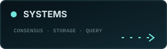](https://asp53826.github.io/systems/) | [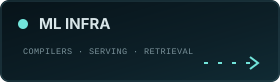](https://asp53826.github.io/ml-infrastructure/) | [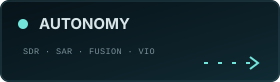](https://asp53826.github.io/defense/) | [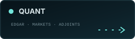](https://asp53826.github.io/quant/) |
|---|---|---|---|

Each route is a short, role-specific path through live systems, source, tests,
measured evidence, and the regime where the result stops holding.

**[PROOFGRAPH](https://asp53826.github.io/proofgraph/)** is the interactive
router across those routes: choose a hiring lens, then traverse one claim
through its attack, oracle, measurement, boundary, exact source revision, and
signed receipt.

## Eight proof cartridges

| [](https://asp53826.github.io/counterexample/) | [](https://asp53826.github.io/labs/faultline/) |
|---|---|
| [](https://asp53826.github.io/labs/kernelarena/) | [](https://asp53826.github.io/labs/signalroom/) |
| [](https://asp53826.github.io/edgar-mcp/) | [](https://github.com/asp53826/vllm-lite) |
| [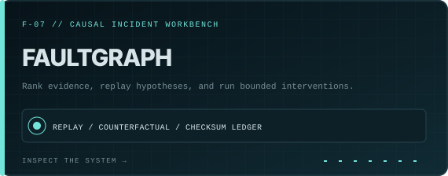](https://github.com/asp53826/faultgraph) | [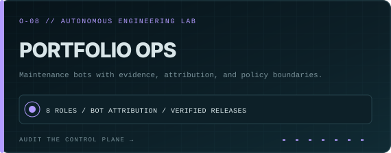](https://github.com/asp53826/portfolio-ops) |

### Current flagship: COUNTEREXAMPLE

Twelve losing regimes from eight public engines live in one constrained failure
register. Each capsule binds the mechanism, attack, oracle, limitation, exact
source revision, downloadable receipt, and GitHub-signed stable release.

**[Operate the register](https://asp53826.github.io/counterexample/)** ·
**[Inspect the source](https://github.com/asp53826/counterexample)** ·
**[Verify the release](https://github.com/asp53826/counterexample/releases/tag/v1.0.0)** ·
**[Submit a bounded counterexample](https://github.com/asp53826/counterexample/issues/new/choose)**

### Current release: FaultGraph

**[FaultGraph](https://github.com/asp53826/faultgraph)** is a causal incident
analysis workbench for operating on evidence rather than decorating a postmortem.
It combines a FastAPI service, typed event contracts, checksum-addressed SQLite
experiments, server-sent events, and a React/TypeScript forensic console.

| surface | released evidence |
|---|---|
| **Model** | transparent dynamic linear influence model with documented assumptions and bounded `do(source=0)` counterfactuals |
| **Workbench** | dependency graph, event timeline, ranked evidence, competing hypotheses, replay ledger, and keyboard command palette |
| **Verification** | **11 backend + 4 frontend tests**, strict type/lint gates, container build, CodeQL, and zero open security alerts at release |
| **Supply chain** | signed **[v0.1.0](https://github.com/asp53826/faultgraph/releases/tag/v0.1.0)** wheel, workbench archive, checksums, and GitHub attestations |

The model is deliberately bounded: it ranks evidence and executes explicit
interventions; it does not claim unrestricted causal discovery from arbitrary
observational logs.

**[Inspect the workbench](https://github.com/asp53826/faultgraph)** ·
**[Read the architecture](https://github.com/asp53826/faultgraph/blob/main/docs/ARCHITECTURE.md)** ·
**[Audit the research protocol](https://github.com/asp53826/faultgraph/blob/main/docs/RESEARCH_PROTOCOL.md)** ·
**[Verify CI](https://github.com/asp53826/faultgraph/actions/runs/31710995157)**

## Three reproducible passports

| system | mechanism | measured proof | reproduce |
|---|---|---|---|
| **[raft-mvcc](https://github.com/asp53826/raft-mvcc)** | Raft + serializable MVCC + linearizability checking | **598 assertions** across seeded faults; **11-tick** five-node failover | `make test` |
| **[edgar-mcp](https://github.com/asp53826/edgar-mcp)** | bounded SEC tools + cache validation + global pacing | **32 tests**; **138×** warm 10-K read; SEC ceiling enforced | `make test` |
| **[track-fusion](https://github.com/asp53826/track-fusion)** | IMM + JPDA + track scoring + OSPA | **47%** lower localization error in the published winning regime; failure sweep included | `python -m pytest -q` |

<details>
<summary><strong>Clone and run all three</strong></summary>

```bash
git clone https://github.com/asp53826/raft-mvcc && cd raft-mvcc && make test
git clone https://github.com/asp53826/edgar-mcp && cd edgar-mcp && make test
git clone https://github.com/asp53826/track-fusion && cd track-fusion && python -m pip install -e '.[dev]' && python -m pytest -q
```

</details>

## The engineering contract

> Build the mechanism. Attack the assumption. Measure against a named
> baseline. Publish the boundary. Bind the evidence to source.

The portfolio is organized as an engineering laboratory, not a gallery of
screenshots. The interactive pages expose controls; the repositories expose
implementation and tests; the evidence manifest records commands, units, and
limitations.

| instrument | what it exposes |
|---|---|
| **[FAULTLINE](https://asp53826.github.io/labs/faultline/)** | a real C++17 Raft + MVCC engine in WebAssembly, including minority leaders, conflict repair, and passing or failing histories |
| **[KERNELARENA](https://asp53826.github.io/labs/kernelarena/)** | typed tensor IR, fusion, liveness-aware memory reuse, generated WGSL, and a browser-local oracle |
| **[SIGNALROOM](https://asp53826.github.io/labs/signalroom/)** | truth, measurements, residuals, uncertainty, and the manoeuvre regime where an estimator loses |
| **[MARKETWIRE](https://asp53826.github.io/labs/marketwire/)** | toxicity, quote age, inventory control, deterministic shocks, and a committed 20,000-step benchmark |
| **[WITNESS](https://asp53826.github.io/witness/)** | receipt hashing, pinned browser execution, deterministic oracles, tamper detection, and local run receipts |
| **[Benchmark Observatory](https://asp53826.github.io/benchmarks/)** | exact commits, commands, environments, units, baselines, and limitations |
| **[Demo Cinema](https://asp53826.github.io/cinema/)** | four captioned engineering films under one minute with direct routes into the running system |

<details>
<summary><strong>Open the complete source catalog</strong></summary>

### Evidence + reliability

**[faultgraph](https://github.com/asp53826/faultgraph)** ·
**[counterexample](https://github.com/asp53826/counterexample)** ·
**[portfolio-ops](https://github.com/asp53826/portfolio-ops)** ·
**[witness](https://github.com/asp53826/witness)** ·
**[proofgraph](https://github.com/asp53826/proofgraph)**

### Correctness + storage

**[raft-mvcc](https://github.com/asp53826/raft-mvcc)** ·
**[dst-harness](https://github.com/asp53826/dst-harness)** ·
**[hotstuff-bft](https://github.com/asp53826/hotstuff-bft)** ·
**[wal-recovery](https://github.com/asp53826/wal-recovery)** ·
**[lsm-tree](https://github.com/asp53826/lsm-tree)** ·
**[columnar-engine](https://github.com/asp53826/columnar-engine)** ·
**[query-planner](https://github.com/asp53826/query-planner)** ·
**[cdcl-sat](https://github.com/asp53826/cdcl-sat)**

### ML infrastructure

**[tensorforge-webgpu](https://github.com/asp53826/tensorforge-webgpu)** ·
**[vllm-lite](https://github.com/asp53826/vllm-lite)** ·
**[annlite](https://github.com/asp53826/annlite)** ·
**[dist-train](https://github.com/asp53826/dist-train)** ·
**[feature-store](https://github.com/asp53826/feature-store)** ·
**[rag-eval](https://github.com/asp53826/rag-eval)** ·
**[grammar-decode](https://github.com/asp53826/grammar-decode)** ·
**[ptq-budget](https://github.com/asp53826/ptq-budget)** ·
**[agent-harness](https://github.com/asp53826/agent-harness)** ·
**[codebase-qa](https://github.com/asp53826/codebase-qa)**

### Signal + autonomy

**[sdr-receiver](https://github.com/asp53826/sdr-receiver)** ·
**[sar-focus](https://github.com/asp53826/sar-focus)** ·
**[track-fusion](https://github.com/asp53826/track-fusion)** ·
**[vio-nav](https://github.com/asp53826/vio-nav)**

### Financial data + markets

**[edgar-mcp](https://github.com/asp53826/edgar-mcp)** ·
**[xbrl-normalize](https://github.com/asp53826/xbrl-normalize)** ·
**[lob-market-making](https://github.com/asp53826/lob-market-making)** ·
**[aad-greeks](https://github.com/asp53826/aad-greeks)** ·
**[backtest-honest](https://github.com/asp53826/backtest-honest)**

</details>

<details>
<summary><strong>Inspect source-backed telemetry and delivery</strong></summary>

<picture>
  <source media="(prefers-color-scheme: dark)" srcset="assets/telemetry-dark.svg">
  <source media="(prefers-color-scheme: light)" srcset="assets/telemetry-light.svg">
  
</picture>

<picture>
  <source media="(prefers-color-scheme: dark)" srcset="assets/toolchain-dark.svg">
  <source media="(prefers-color-scheme: light)" srcset="assets/toolchain-light.svg">
  
</picture>

The daily workflow reads public source and counts test functions without a
third-party stats card or page-load API call. Parametrized and looped suites
execute more checks than the function count—for example, `raft-mvcc` alone
executes 598 assertions.

</details>

## Autonomous operations

**[Portfolio Ops](https://github.com/asp53826/portfolio-ops)** maintains the
public systems through eight auditable roles: repository verification,
benchmark evidence, dependency care, documentation checks, demo monitoring,
verified releases, achievement-state monitoring, and profile curation.
Automation uses the GitHub Actions bot identity, retains raw evidence, and does
not manufacture human contributions or interact with third-party repositories.

Patch dependency updates may auto-merge only after repository checks pass.
Source changes, major upgrades, external contributions, benchmark claims, and
account or legal decisions remain outside the autonomous boundary.

<!-- portfolio-status:start -->
| Project | Primary language | Latest release | Latest completed workflow |
|---|---|---|---|
| [faultgraph](https://github.com/asp53826/faultgraph) | Python | [v0.1.0](https://github.com/asp53826/faultgraph/releases/tag/v0.1.0) | [Autonomous Engineering Lab: success](https://github.com/asp53826/faultgraph/actions/runs/33406863998) |
| [raft-mvcc](https://github.com/asp53826/raft-mvcc) | C++ | [v1.0.0](https://github.com/asp53826/raft-mvcc/releases/tag/v1.0.0) | [Autonomous Engineering Lab: success](https://github.com/asp53826/raft-mvcc/actions/runs/32943089923) |
| [edgar-mcp](https://github.com/asp53826/edgar-mcp) | Python | [v0.1.0](https://github.com/asp53826/edgar-mcp/releases/tag/v0.1.0) | [Autonomous Engineering Lab: success](https://github.com/asp53826/edgar-mcp/actions/runs/33398621054) |
| [track-fusion](https://github.com/asp53826/track-fusion) | Python | No published release | [Autonomous Engineering Lab: success](https://github.com/asp53826/track-fusion/actions/runs/32821633847) |
| [tensorforge-webgpu](https://github.com/asp53826/tensorforge-webgpu) | TypeScript | No published release | [Autonomous Engineering Lab: success](https://github.com/asp53826/tensorforge-webgpu/actions/runs/33110404926) |
| [columnar-engine](https://github.com/asp53826/columnar-engine) | C++ | No published release | [Autonomous Engineering Lab: success](https://github.com/asp53826/columnar-engine/actions/runs/32943112414) |
| [lsm-tree](https://github.com/asp53826/lsm-tree) | C++ | No published release | [Autonomous Engineering Lab: success](https://github.com/asp53826/lsm-tree/actions/runs/32830305223) |
| [counterexample](https://github.com/asp53826/counterexample) | CSS | [v1.0.0](https://github.com/asp53826/counterexample/releases/tag/v1.0.0) | [OpenSSF Scorecard: success](https://github.com/asp53826/counterexample/actions/runs/32820221538) |
| [portfolio-ops](https://github.com/asp53826/portfolio-ops) | Python | No published release | [Achievement Scout: success](https://github.com/asp53826/portfolio-ops/actions/runs/33408195391) |

This block is regenerated only when GitHub's repository, release, or workflow data changes.
<!-- portfolio-status:end -->

## Open channel

**[aaryansp26@gmail.com](mailto:aaryansp26@gmail.com)** ·
**[Systems résumé](https://asp53826.github.io/resume/Aaryan-Patel-Systems-Resume.pdf)** ·
**[Systems Observatory](https://asp53826.github.io/)** ·
**[LinkedIn](https://www.linkedin.com/in/aaryanpatelsystems/)**

UGA computer science, December 2026. Industrial data engineering at
**MP Equipment**. Every system above is MIT licensed: clone one, run the
benchmark, and inspect the regime where it breaks.

<sub>All profile visuals are first-party SVGs generated in this repository.
Motion is limited to signal flow and respects <code>prefers-reduced-motion</code>.</sub>
