<picture>
  <source media="(prefers-color-scheme: dark)" srcset="banner-dark.svg">
  <source media="(prefers-color-scheme: light)" srcset="banner-light.svg">
  
</picture>

<p align="center">
  <a href="https://asp53826.github.io/labs/"><strong>ENTER THE PROOF LABORATORY</strong></a>&nbsp;&nbsp;·&nbsp;&nbsp;
  <a href="https://asp53826.github.io/">SYSTEMS OBSERVATORY</a>&nbsp;&nbsp;·&nbsp;&nbsp;
  <a href="https://asp53826.github.io/resume/Aaryan-Patel-Systems-Resume.pdf">RÉSUMÉ</a>&nbsp;&nbsp;·&nbsp;&nbsp;
  <a href="https://asp53826.github.io/data/evidence.json">EVIDENCE MANIFEST</a>
</p>

<a href="https://asp53826.github.io/">
  
</a>

## Interactive verification

| enter | what you can verify |
|---|---|
| **[FAULTLINE](https://asp53826.github.io/labs/faultline/)** | operate the real C++17 Raft + MVCC engine in WebAssembly; create a minority leader, heal conflict, and run both passing and failing linearizability histories |
| **[SIGNALROOM](https://asp53826.github.io/labs/signalroom/)** | replay IMM, JPDA, VIO, and SAR regimes while truth, measurements, residuals, and the losing condition remain visible |
| **[MARKETWIRE](https://asp53826.github.io/labs/marketwire/)** | change toxicity, quote age, and inventory control; compare the explanatory tape with the committed 20,000-step, 12-seed benchmark |
| **[KERNELARENA](https://asp53826.github.io/labs/kernelarena/)** | invoke the running TensorForge compiler across three shapes; inspect IR, fusion, memory reuse, generated WGSL, and a browser-local oracle |
| **[Benchmark Observatory](https://asp53826.github.io/benchmarks/)** | inspect exact commits, commands, environments, units, and limitations without forcing unrelated metrics onto one leaderboard |
| **[Engineering papers](https://asp53826.github.io/papers/)** | read the method and failure analysis behind consensus partitions, sensor-fusion losses, market risk, AAD, and GPU compilation |
| **[Demo Cinema](https://asp53826.github.io/cinema/)** | watch four narrated, captioned engineering films under one minute, then enter the corresponding live system |
| **[Three-minute proof tours](https://asp53826.github.io/tours/)** | follow Systems, Autonomy, Quant, or ML Infrastructure through mechanism → attack → oracle → boundary |
| **[Merged contribution track](https://asp53826.github.io/contributions/)** | inspect accepted changes outside my own repositories without vanity counts or fabricated collaboration |
| **[Verification Theater](https://asp53826.github.io/#theater)** | inject a published failure into `raft-mvcc`, `edgar-mcp`, or `track-fusion`; replay six deterministic checkpoints; open the source and benchmark drawer |
| **[90-second recruiter tour](https://asp53826.github.io/)** | select Systems, Quant, Defense, or ML Infrastructure and move through a timed, pausable proof narrative |
| **[Architecture constellation](https://asp53826.github.io/#map)** | see how twelve systems connect through one command/source/oracle/limitation contract |
| **[Evidence desk](https://asp53826.github.io/#evidence-desk)** | ask where a system loses, how it was verified, or how to reproduce it; answers are restricted to the committed manifest |
| **[Benchmark time machine](https://asp53826.github.io/#ledger)** | inspect the invalid baseline, correction, commit, and current verification command |

**Download a role packet:** [Systems](https://asp53826.github.io/recruiter/systems.pdf) · [Quant / Finance](https://asp53826.github.io/recruiter/quant.pdf) · [Defense / Autonomy](https://asp53826.github.io/recruiter/defense.pdf) · [ML Infrastructure](https://asp53826.github.io/recruiter/ml-infrastructure.pdf)

## Choose your signal

| recruiter route | enter through | three strongest proofs |
|---|---|---|
| **Systems** | **[open route](https://asp53826.github.io/systems/)** | [raft-mvcc](https://github.com/asp53826/raft-mvcc) · [columnar-engine](https://github.com/asp53826/columnar-engine) · [dst-harness](https://github.com/asp53826/dst-harness) |
| **Quant / Finance** | **[open route](https://asp53826.github.io/quant/)** | [edgar-mcp](https://github.com/asp53826/edgar-mcp) · [aad-greeks](https://github.com/asp53826/aad-greeks) · [lob-market-making](https://github.com/asp53826/lob-market-making) |
| **Defense / Autonomy** | **[open route](https://asp53826.github.io/defense/)** | [track-fusion](https://github.com/asp53826/track-fusion) · [sar-focus](https://github.com/asp53826/sar-focus) · [vio-nav](https://github.com/asp53826/vio-nav) |
| **ML Infrastructure** | **[open route](https://asp53826.github.io/ml-infrastructure/)** | [annlite](https://github.com/asp53826/annlite) · [vllm-lite](https://github.com/asp53826/vllm-lite) · [dist-train](https://github.com/asp53826/dist-train) |

> **Current flagship:** FAULTLINE compiles the repository's C++17 consensus,
> MVCC, and linearizability sources to WebAssembly. The same release pipeline
> ships native and browser artifacts with checksums, an SPDX SBOM, and
> GitHub-signed provenance.

## Three proof passports

| [raft-mvcc](https://github.com/asp53826/raft-mvcc) | [edgar-mcp](https://github.com/asp53826/edgar-mcp) | [track-fusion](https://github.com/asp53826/track-fusion) |
|---|---|---|
| Raft + serializable MVCC + linearizability checking | bounded EDGAR tools + cache validation + global pacing | IMM + JPDA + track scoring + OSPA |
| **598 assertions** across seeded faults | **138×** warm 10-K read; SEC ceiling enforced | **47%** lower localization error; failure sweep published |
| `make test` | `make test` | `python -m pytest -q` |

<details>
<summary><strong>Start here — reproduce all three flagship results</strong></summary>

```bash
git clone https://github.com/asp53826/raft-mvcc && cd raft-mvcc && make test
git clone https://github.com/asp53826/edgar-mcp && cd edgar-mcp && make test
git clone https://github.com/asp53826/track-fusion && cd track-fusion && python -m pip install -e '.[dev]' && python -m pytest -q
```

</details>

## Verification deck

<picture>
  <source media="(prefers-color-scheme: dark)" srcset="assets/credentials-dark.svg">
  <source media="(prefers-color-scheme: light)" srcset="assets/credentials-light.svg">
  
</picture>

<p align="center">
  <a href="https://github.com/asp53826/edgar-mcp/actions/workflows/ci.yml"></a>&nbsp;
  <a href="https://github.com/asp53826/raft-mvcc/actions/workflows/ci.yml"></a>&nbsp;
  <a href="https://github.com/asp53826/columnar-engine/actions/workflows/ci.yml"></a>&nbsp;
  <a href="https://github.com/asp53826/annlite/actions/workflows/ci.yml"></a>
</p>
<p align="center">
  <a href="https://github.com/asp53826/agent-harness/actions/workflows/ci.yml"></a>&nbsp;
  <a href="https://github.com/asp53826/sar-focus/actions/workflows/ci.yml"></a>&nbsp;
  <a href="https://github.com/asp53826/track-fusion/actions/workflows/ci.yml"></a>&nbsp;
  <a href="https://github.com/asp53826/vio-nav/actions/workflows/ci.yml"></a>
</p>
<p align="center">
  <a href="https://github.com/asp53826/dst-harness/actions/workflows/ci.yml"></a>&nbsp;
  <a href="https://github.com/asp53826/cdcl-sat/actions/workflows/ci.yml"></a>&nbsp;
  <a href="https://github.com/asp53826/query-planner/actions/workflows/ci.yml"></a>
</p>

<sub>The credential array is generated from the public source itself. The live
status badges come directly from each repository's GitHub Actions workflow—no
third-party badge service, decorative certifications, or invented awards.</sub>

## Systems, not scripts

I'm a computer science undergrad at UGA building the layer underneath the
model: storage engines, distributed runtimes, retrieval systems, signal
processors, and financial-data infrastructure.

Every repository follows the same contract:

> **Build the mechanism. Attack the assumptions. Measure against a real
> baseline. Publish where it loses.**

That means the output is not a screenshot or a notebook that ran once. It is a
reproducible benchmark, a correctness oracle, or a fault campaign that another
engineer can clone and challenge.

## Current signal

| system | what is implemented | measured proof |
|---|---|---:|
| **[edgar-mcp](https://github.com/asp53826/edgar-mcp)** ([live](https://asp53826.github.io/edgar-mcp/)) | MCP server over SEC EDGAR with identity resolution, filing overflow history, bounded text windows, XBRL discovery, per-host caching, and a global request pacer | **32 tests**; warm 10-K read **138×** faster; peak request window held at the SEC's **10 req/s** ceiling |
| **[xbrl-normalize](https://github.com/asp53826/xbrl-normalize)** ([live](https://asp53826.github.io/xbrl-normalize/)) | 19 canonical financial line items with period-aware tag selection, restatement handling, derivations, provenance, and accounting-identity checks | **102-company** cross-industry benchmark; assets and liabilities at **100% coverage**; **96.1%** exact identity balance |
| **[lob-market-making](https://github.com/asp53826/lob-market-making)** ([live](https://asp53826.github.io/lob-market-making/)) | limit order book with price-time priority and post-only orders, informed-trader flow, three quoting strategies, exact PnL decomposition, and adverse-selection measurement | **36 tests**; paired 12-seed comparison; the naive strategy wins on PnL and loses on every risk-adjusted metric at **7×** the inventory deviation |
| **[aad-greeks](https://github.com/asp53826/aad-greeks)** | tape-based reverse-mode automatic differentiation over Monte Carlo paths, with pricers written once and differentiated rather than hand-derived | **19 tests**; Greeks match analytic formulas to **5.6e-16**; cost stays **1.7-2.4×** the price across a 50× change in input count |
| **[raft-mvcc](https://github.com/asp53826/raft-mvcc)** | Raft elections, conflict repair and majority commit combined with serializable MVCC, safe-point GC, and P-compositional linearizability checking | **598 assertions** across seeded partitions; **11-tick** five-node failover in the in-process simulator |
| **[columnar-engine](https://github.com/asp53826/columnar-engine)** | C++17 vector-at-a-time engine with null bitmaps, selection vectors, joins, aggregation, TPC-H Q1, and scalar differential oracles | **6,288 assertions**; Q1 at **53.1M rows/s**; batched filters **1.94×** scalar |
| **[dst-harness](https://github.com/asp53826/dst-harness)** | deterministic simulation testing: virtual clock, network and disk, seeded fault injection, Raft's five safety properties, and a Wing-Gong linearizability checker over the client history | **12 of 12** planted Raft defects caught, seeds-to-first-catch **1 to 485**; control clean over **2,000 seeds**; found **2 real bugs**, both written up with reproducing seeds |
| **[cdcl-sat](https://github.com/asp53826/cdcl-sat)** | CDCL solver in C++17: watched literals with blockers, 1UIP analysis with recursive minimization, VSIDS, Luby restarts, LBD reduction, DRAT proof emission | **1,960 assertions**; **180/180** refutations verified by **drat-trim**, an external checker; **300/300** verdicts agreeing with CaDiCaL 3.0.1 |
| **[query-planner](https://github.com/asp53826/query-planner)** | histograms, MCV lists and a from-scratch HyperLogLog feeding System R estimation; bushy DP, left-deep DP and greedy search; a vectorised executor so plans can be timed | q-errors to **76×** cost **1.00×** runtime against a perfect-information oracle, while left-deep search costs **2.15×**; cost model rank correlation **0.77** |
| **[hotstuff-bft](https://github.com/asp53826/hotstuff-bft)** | chained HotStuff driven by an adversary that equivocates, withholds, reorders and forges certificates, with checkers scored by a mutation catalogue | safety clean at and below **f** and broken immediately above it at both n=4 and n=7; **5/9** broken rules caught with **0** false positives; **3 real bugs** found, each with a reproducing seed |
| **[ptq-budget](https://github.com/asp53826/ptq-budget)** | RTN, GPTQ and AWQ against an exact fp32 reference on a corpus whose optimal perplexity is known in closed form | GPTQ halves perplexity damage while sitting **39% further** from the original weights — weight error picks the worse method; granularity alone swings 2-bit damage **239.5% → 30.9%** |
| **[sampling-profiler](https://github.com/asp53826/sampling-profiler)** | SIGPROF sampling with stack aggregation, folded output, and an error analysis scored against workloads of known CPU share | detectability floor derived and verified as **n = 4(1−p)/p**; publishes the two regimes where it is confidently wrong — **66.3% reported as 10.8%**, and a busy thread at **0.0%** |
| **[backtest-honest](https://github.com/asp53826/backtest-honest)** | deflated Sharpe and purged/embargoed CV, calibrated on random walks where every strategy's true Sharpe is zero | a 500-variant search on pure noise posts Sharpe **0.99**; uncorrected backtests declare a discovery in **7.5%** of signal-free markets, deflated Sharpe in **0%** |

<picture>
  <source media="(prefers-color-scheme: dark)" srcset="assets/proof-dark.svg">
  <source media="(prefers-color-scheme: light)" srcset="assets/proof-light.svg">
  
</picture>

<sub>Only results that reduce to a ratio over a <em>named</em> baseline appear
above. Throughput, utilisation and drift are not comparable quantities, so
putting them on one axis without a baseline would be decoration dressed as
evidence — the conformance rates, crash campaigns and coverage numbers stay in
the tables where the units survive.</sub>

<picture>
  <source media="(prefers-color-scheme: dark)" srcset="assets/system-map-dark.svg">
  <source media="(prefers-color-scheme: light)" srcset="assets/system-map-light.svg">
  
</picture>

## Build channels

### Financial data

| project | evidence |
|---|---|
| **[edgar-mcp](https://github.com/asp53826/edgar-mcp)** | EDGAR filing/facts tools; cache validation; iXBRL cleanup; context-safe windows; rate-limit enforcement |
| **[xbrl-normalize](https://github.com/asp53826/xbrl-normalize)** | comparable statements across 102 filers; provenance on every value; missing is never silently zero |
| **[lob-market-making](https://github.com/asp53826/lob-market-making)** | post-only matching, informed flow, exact spread-capture/inventory split; two bugs that flattered the results are documented in `DESIGN.md` |
| **[aad-greeks](https://github.com/asp53826/aad-greeks)** ([live](https://asp53826.github.io/aad-greeks/)) | adjoint Greeks at constant cost in the input count; publishes the payoff where pathwise AAD returns a delta of exactly zero and is silently wrong |
| **[backtest-honest](https://github.com/asp53826/backtest-honest)** | measures its own selection bias against a market with no signal, and publishes the edge size its own correction is too weak to certify |

### Storage + execution

| project | evidence |
|---|---|
| **[lob-market-making](https://github.com/asp53826/lob-market-making)** | price-time priority, post-only orders, informed flow, exact PnL decomposition, and a paired strategy comparison across 12 seeds |
| **[aad-greeks](https://github.com/asp53826/aad-greeks)** | reverse-mode AD over Monte Carlo paths; Greeks match analytic formulas to **5.6e-16** while cost stays **1.7–2.4×** the price across a 50× change in input count |
| **[raft-mvcc](https://github.com/asp53826/raft-mvcc)** | consensus + serializable snapshots + machine-checkable histories |
| **[columnar-engine](https://github.com/asp53826/columnar-engine)** | vectorized execution checked against scalar oracles |
| **[lsm-tree](https://github.com/asp53826/lsm-tree)** | WAL, memtables, SSTables, Bloom filters, range scans, crash-safe compaction; **4,064 assertions** |
| **[wal-recovery](https://github.com/asp53826/wal-recovery)** | CRC32 records, damaged-tail repair, atomic replay; 100 crash trials with **zero acknowledged writes lost** |
| **[query-planner](https://github.com/asp53826/query-planner)** | join ordering, cost model and cardinality estimation scored against a perfect-information oracle; reports that the search space matters **20× more** than the estimates |

### Correctness + verification

| project | evidence |
|---|---|
| **[dst-harness](https://github.com/asp53826/dst-harness)** | deterministic simulation with seeded partitions, crashes and torn writes; scored by seeds-to-first-catch over **12 planted Raft defects**, and it found two real ones in its own target |
| **[cdcl-sat](https://github.com/asp53826/cdcl-sat)** | every UNSAT answer emitted as a DRAT refutation and verified by **drat-trim**, not by me; publishes the ablation where its own restart strategy is worth nothing |
| **[sampling-profiler](https://github.com/asp53826/sampling-profiler)** | scores a profiler against known ground truth and reports where it cannot see: a C call at 6× underattribution and a worker thread at zero |
| **[hotstuff-bft](https://github.com/asp53826/hotstuff-bft)** | proves the adversary is strong enough before making any safety claim — the same harness must break safety above **f**, and does; four surviving mutants are published rather than dropped |

### ML infrastructure

| project | evidence |
|---|---|
| **[ptq-budget](https://github.com/asp53826/ptq-budget)** | weight-only INT8/4/3/2 with an exact oracle; publishes that its own headline metric, weight error, ranks the methods backwards |
| **[vllm-lite](https://github.com/asp53826/vllm-lite)** | paged KV cache, continuous batching, prefix caching, speculative decoding; **94% vs 21%** KV utilization |
| **[annlite](https://github.com/asp53826/annlite)** | HNSW + SIMD + Python bindings; FAISS parity at 0.99 recall and **1.83×** faster at 0.999 |
| **[dist-train](https://github.com/asp53826/dist-train)** | ring all-reduce from `send`/`recv`; **58.7 vs 234.9 MB/worker** at eight workers |
| **[rag-eval](https://github.com/asp53826/rag-eval)** | hybrid retrieval, reranking, hallucination metrics, and CI gates; SciFact **0.6643 vs 0.665** published BM25 |
| **[feature-store](https://github.com/asp53826/feature-store)** | point-in-time joins and streaming materialization; leakage measured at **+0.059 AUC** |
| **[grammar-decode](https://github.com/asp53826/grammar-decode)** | JSON Schema → character automaton → cached token mask; **100% vs 0%** conformance baseline |
| **[agent-harness](https://github.com/asp53826/agent-harness)** | five-layer sandbox and graded benchmark; 58 tests, including **26 escape attempts** |
| **[codebase-qa](https://github.com/asp53826/codebase-qa)** | auth, rate limits, durable jobs, cost tracking, and tracing—the prototype-to-service gap |

### Signal + autonomy

| project | evidence |
|---|---|
| **[sdr-receiver](https://github.com/asp53826/sdr-receiver)** | QPSK, RRC, acquisition, soft decisions, LDPC; **0 errors in 21,600 bits** at 4–8 dB after the waterfall |
| **[sar-focus](https://github.com/asp53826/sar-focus)** | pulse compression, backprojection, PGA autofocus; resolution within **0.5%** of theory |
| **[track-fusion](https://github.com/asp53826/track-fusion)** | IMM + JPDA + Wald scoring + OSPA; reports the manoeuvre regime where IMM wins and straight-line regime where it costs |
| **[vio-nav](https://github.com/asp53826/vio-nav)** | MSCKF, SO(3) preintegration, null-space feature marginalisation; **51.9×** lower drift than inertial dead reckoning |

## Interactive results

Four of these publish a live page built in the same repository — no CDN, no
third-party script, and every figure traceable to the benchmark that produced it.

| page | what you can drive |
|---|---|
| **[aad-greeks](https://asp53826.github.io/aad-greeks/)** | drag the bump size and watch a finite difference find its error floor and climb back out of it; drag payoff smoothing and watch an adjoint delta go from exactly zero to correct |
| **[lob-market-making](https://asp53826.github.io/lob-market-making/)** | a live order book getting picked off, with sliders for spread, inventory skew and toxic flow; re-sort the strategy table and watch the ranking invert |
| **[xbrl-normalize](https://asp53826.github.io/xbrl-normalize/)** | step the tag resolver through five filers and watch it reject stale tags; toggle mezzanine equity and watch the balance sheet stop balancing |
| **[edgar-mcp](https://asp53826.github.io/edgar-mcp/)** | fire a burst of tool calls at a token bucket and a strict pacer, and see which one breaks the limit it enforces |

## Portfolio telemetry

<picture>
  <source media="(prefers-color-scheme: dark)" srcset="assets/telemetry-dark.svg">
  <source media="(prefers-color-scheme: light)" srcset="assets/telemetry-light.svg">
  
</picture>

<sub>Regenerated daily by <a href=".github/workflows/profile.yml">GitHub
Actions</a>. The panel reads the repositories and counts test functions from
source; no third-party stats card, hand-edited total, or page-load API call is
involved. Parametrized suites and looped invariants expand into many more checks
than the function count—for example, <code>raft-mvcc</code> alone executes 598
assertions.</sub>

## Toolchain + delivery

<picture>
  <source media="(prefers-color-scheme: dark)" srcset="assets/toolchain-dark.svg">
  <source media="(prefers-color-scheme: light)" srcset="assets/toolchain-light.svg">
  
</picture>

<sub>Every item appears in public source, a build manifest, a CI workflow, or a
reproducible verification path in this portfolio. The matrix is generated in
this repository and does not depend on a third-party badge service.</sub>

## Working stack

```text
SYSTEMS    C++17 · Python · Raft · MVCC · WAL · LSM/SSTables · SIMD · POSIX
ML INFRA   PyTorch · distributed collectives · HNSW · BM25 · reranking · evals
FINANCE    SEC EDGAR · XBRL · accounting identities · provenance · MCP
MARKETS    limit order books · price-time priority · adverse selection · Avellaneda-Stoikov
QUANT      adjoint AD · pathwise Greeks · Black-Scholes · Monte Carlo · payoff smoothing
SIGNAL     QPSK · RRC · LDPC · SAR · Kalman/IMM · JPDA · OSPA
ESTIMATE   IMU preintegration · SO(3) · MSCKF · ATE/RPE · triangulation
SERVICES   FastAPI · SQLite/Postgres · durable queues · scrypt · tracing
INDUSTRY   Power BI · Node-RED · CtrlX Core · ERP automation
```

Day job: automation and analytics at **MP Equipment**—dashboards, ERP
automation, and AR/AI for industrial food processing.

## Open channel

**[aaryansp26@gmail.com](mailto:aaryansp26@gmail.com)** ·
**[one-page systems résumé](https://asp53826.github.io/resume/Aaryan-Patel-Systems-Resume.pdf)** ·
**[Systems Observatory](https://asp53826.github.io/)**

Every system above is MIT licensed. Clone one, run the benchmark, and inspect
the regime where it breaks.

<sub>Hero, topology, and telemetry are generated in this repository. Both
themes are first-party SVGs and respect <code>prefers-reduced-motion</code>.</sub>
